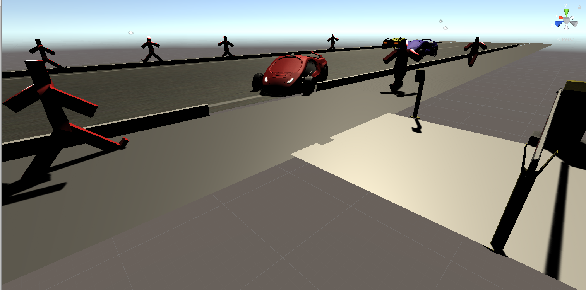
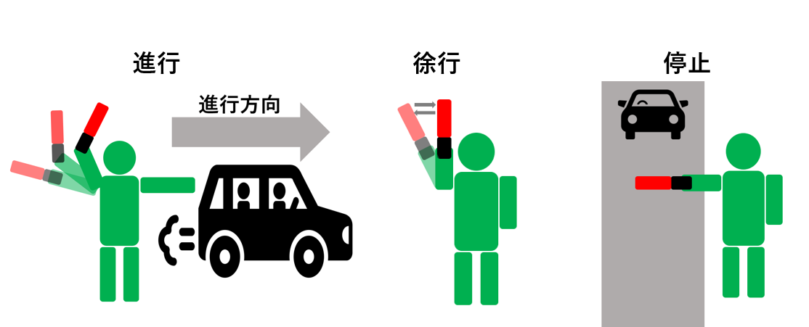
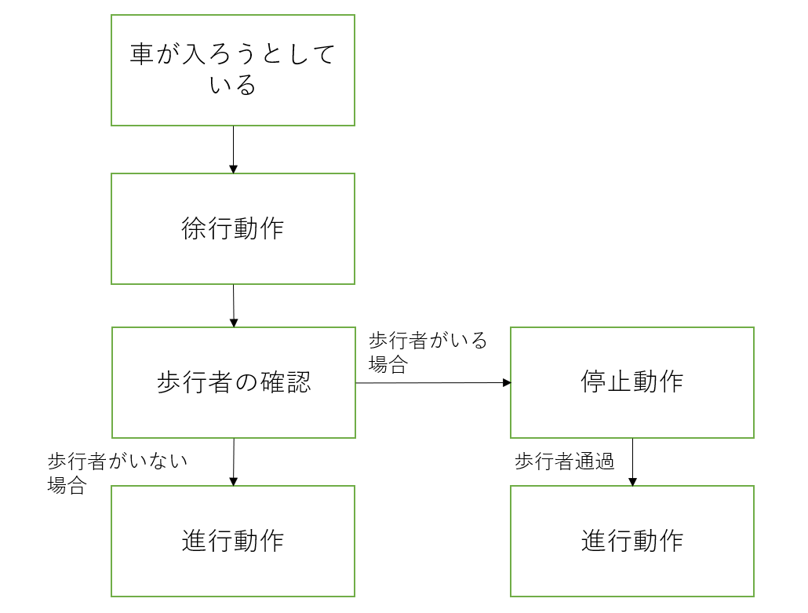
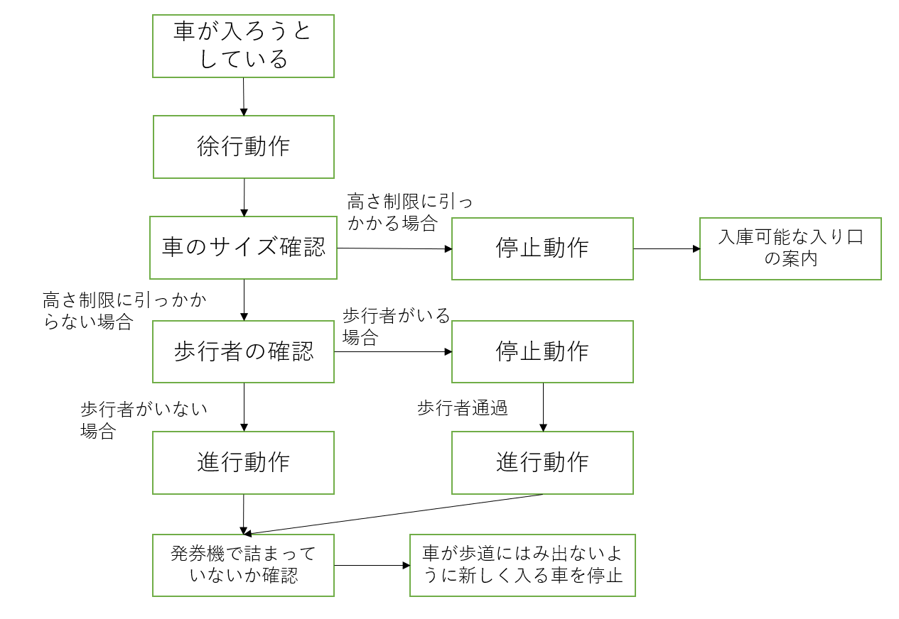

## 世界観
ショッピングモールの駐車場を再現する。以下の画像（図１）のようなイメージで、二車線の外側に歩道があり、歩道を跨いでショッピングモールに車が入ってくる。

図１：警備員視点

## ユーザー体験
車両入り口に立つ警備員視点で安全でスムーズな入車の誘導を行う。車は基本的には左折での入庫で、歩行者優先（歩行者を停止させるのは基本的にはダメ）で誘導しなければならない。基本動作は「進行合図動作」「徐行合図動作」「停止合図動作」（図２）がある。

図２：進行・徐行・停止の合図

## ストーリー
最低限必要なのは図３のようなストーリーで、可能であれば図４のように拡張部分を加えていく。誘導ミスで事故を起こしてしまった場合はバッドエンド（ゲームオーバー）、歩行者や車のイライラ度が一定以上になっても同じくバッドエンドとする。事故もなくイライラ度も一定以下であれば、グッドエンド（クリア）とする。

図３：最低限必要

図４：拡張部分を加えた

## 操作
ユーザーの動作は上記の図２の「進行合図動作」「徐行合図動作」「停止合図動作」の三つである。
進行合図動作→右手を進行方向である駐車場に伸ばして、誘導灯を持った左手で車を招くような合図をとる。
停止予告（徐行合図動作）→ウインカーで駐車場に入る意思が確認出来たら、誘導灯を上にまっすぐ掲げて、左右に小さくユラユラと振る。運転手に見えなければならないので胸元で振っても意味がない。
停止合図動作→停止予告の動作から誘導灯を肩の高さまで水平に降ろす。停止した車両に対しては感謝の意を表すことが望ましい。
